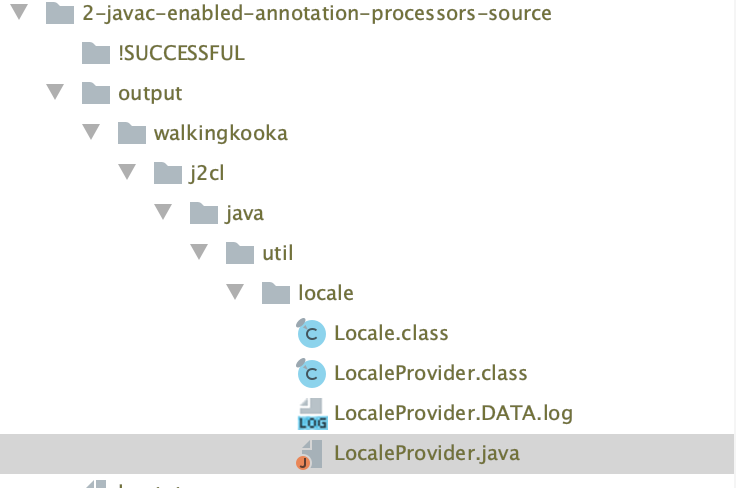

[](https://travis-ci.com/mP1/j2cl-locale.svg.svg?branch=master)
[](https://coveralls.io/github/mP1/j2cl-locale?branch=master)
[](https://opensource.org/licenses/Apache-2.0)
[](https://lgtm.com/projects/g/mP1/j2cl-locale/context:java)
[](https://lgtm.com/projects/g/mP1/j2cl-locale/alerts/)


j2c-locale
=================

This should be considered part of the internal support classes for the emulated `java.util.Locale` and should not be referenced in code.
It contains some utilties that can be used to assist the authoring of annotation processors that generate code or data that is Locale aware,
such as the emulation of `java.text` and others.

The classes included in this project should be considered internal, and this project should only be referenced as a dependency
by [j2cl-java-util-Locale](https://travis-ci.com/mP1/j2cl-java-util-Locale).


# Threeten backport

This project uses a shaded copy of the package `org.threeten.bp.zone` and a few other minimized support classes from the
[org.threeten.bp](https://www.threeten.org/) project.

Changes include:

- Very little code has actually been added except to assist testing and [j2cl-java-util-TimeZone-annotation-processor](https://travis-ci.com/mP1/j2cl-java-util-TimeZone-annotation-processor).
- Most methods not required have not been deleted but have been commented out with slash slash comments. This results in value types such as `LocalDateTime` losing nearly all their beautiful conversion, math etc methods.
- A few methods have been made public to assist [j2cl-java-util-TimeZone-annotation-processor](https://travis-ci.com/mP1/j2cl-java-util-TimeZone-annotation-processor) & [j2cl-java-util-TimeZone](https://travis-ci.com/mP1/j2cl-java-util-TimeZone)
- The inbuilt serialization support for all classes packaged here, has been kept but marked `@GwtIncompatible` and used to create the data used by the emulated `java.util.TimeZone`.
- Note the fork of threeten does not include the accompanying tests, which of course lowers the code coverage of this project significantly.

Click [here](https://github.com/ThreeTen/threetenbp/blob/master/LICENSE.txt) for the official threeten license. 


# Maven usage

## Logging (javac annotation processor argument)

Logging by all related annotation processors may be controlled by the `walkingkooka.j2cl.locale.Logging` annotation. 

- NONE Nothing is written anywhere
- SLASH_SLASH_COMMENTS The generated java source file will contain slash slash comments holding the content.
- TXT_FILE A txt file will be created to match the class file for the generated *.java file plus the file extension `DATA.txt`.

The last two options will contain readable text of the value of the generated provider `private final static String DATA` field. 

```txt
// en-001              language=en         country=001         variant=            script=             encoded=en-001,en,001
// en-150              language=en         country=150         variant=            script=             encoded=en-150,en,150
// en-AG               language=en         country=AG          variant=            script=             encoded=en-AG,en,AG
...
 public final static String DATA = preventInlining("106,en,en-001\\,en\...
```




## Locale selection (javac annotation processor argument)

The locales must be selected by setting a [annotation argument](https://docs.oracle.com/javase/7/docs/technotes/tools/windows/javac.html)
`walkingkooka.java-util-Locale` with a comma separated list of desired locales with trailing wildcard support.

Some examples values include.

- `*` All locales
- `EN` Only includes the `EN` locale without including `EN-US` or `EN-GB`.
- `EN-*` Includes all locales beginning with `EN`.
- `EN-*,FR-*` Include all English and French locales.


### Maven annotation processor argument

```xml
<plugin>
    <groupId>org.apache.maven.plugins</groupId>
    <artifactId>maven-compiler-plugin</artifactId>
    <version>3.8.0</version>
    <configuration>
        <source>9</source>
        <target>9</target>
        <compilerArgs>
            <arg>-Awalkingkooka.j2cl.java.util.Locale=EN-*</arg>
            <arg>-Awalkingkooka.j2cl.locale.Logging=TXT_FILE</arg>
        </compilerArgs>
        <showWarnings>true</showWarnings>
    </configuration>
</plugin>
```

The `ShowWarning` parameter is necessary as all annotation processor sub classes (shown below) print their parameters and
the size of the `DATA` that holds their data encoded in `String` form.

Selecting many locales will result in the size of the `DATA` field being many times larger. This is particularly important
as something such as `java.time` actually uses internally data for many classes:

- `java.text.DateFormatSymbols`
- `java.text.DateFormat`
- `java.text.DecimalFormatSymbols`
- `java.text.DecimalFormat`
- `java.util.Locale`
- `java.text.Currency`
- `java.util.TimeZone`


# Related annotation processors

The following list, contains emulated `java.util.Locale` aware classes and their corresponding annotation processor.
All within the list sub class `walkingkooka.j2cl.locale.annotationprocessor.LocaleAwareAnnotationProcessor` and use other
support classes within this project.

- [Currency](https://github.com/mP1/j2cl-java-util-Currency) supporting [annotation processor](https://github.com/mP1/j2cl-java-util-currency-annotation-processsor)
- [DateFormatSymbols](https://github.com/mP1/j2cl-java-text) supporting [annotation processor](https://github.com/mP1/j2cl-java-text-annotation-processor/blob/master/src/main/java/walkingkooka/j2cl/java/text/annotationprocessor/DateFormatSymbolsProviderAnnotationProcessor.java)
- [DecimalFormat](https://github.com/mP1/j2cl-java-text) supporting [annotation processor](https://github.com/mP1/j2cl-java-text-annotation-processor/blob/master/src/main/java/walkingkooka/j2cl/java/text/annotationprocessor/DecimalFormatProviderAnnotationProcessor.java)
- [DecimalFormatSymbols](https://github.com/mP1/j2cl-java-text) supporting [annotation processor](https://github.com/mP1/j2cl-java-text-annotation-processor/blob/master/src/main/java/walkingkooka/j2cl/java/text/annotationprocessor/DecimalFormatSymbolsProviderAnnotationProcessor.java)
- [Locale](https://github.com/mP1/j2cl-java-util-Locale) supporting [annotation processor](https://github.com/mP1/j2cl-java-util-locale-annotation-processsor)
- [TimeZone](https://github.com/mP1/j2cl-java-util-TimeZone) supporting [annotation processor](https://github.com/mP1/j2cl-java-util-TimeZone-annotation-processsor)


# Authoring annotation processors.

An abstract [AnnotationProcessor](https://github.com/mP1/j2cl-locale/blob/master/src/main/java/walkingkooka/j2cl/locale/annotationprocessor/LocaleAwareAnnotationProcessor.java)
is available with a few template methods which present the selected locales. It also handles some other housekeeping,
relating to the annotation processor lifecycle.

 

# Usage

The preferred way to use the plugin is to checkout the source

```bash
git clone git://github.com/mP1/j2cl-locale.git
```

and build and install with Maven.

```bash
mvn clean install
```


# Contributions

Suggestions via the issue tracker, and pull requests are most welcomed.


